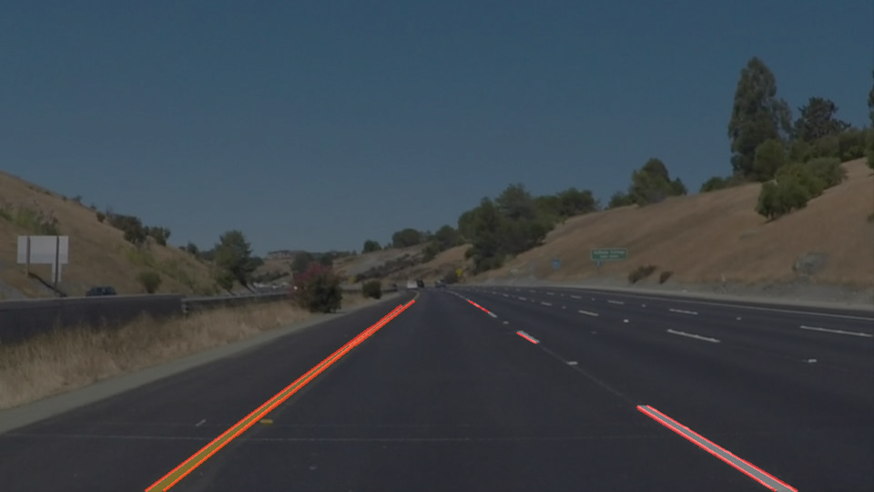

# **Finding Lane Lines on the Road** 

### Reflection

### 1. Pipeline description.

My pipeline consisted of 5 steps:
- converting images to grayscale
- Gaussian smoothing
- Canny Edge detection
- selection of region of interest
- line detection by hough transformation

The color selection was not used, since the color is depending on many factors (day/night, weather, ...) and therefore not precisely selectable hardcoded.

Here, the detected lines of the hough transformation are visualized: 

In order to draw a single line on the left and right lanes, I created a new function "connect_hough_lines", which is based on the function "draw_lines". Within this function, detected lines are sorted by their slope: negative slope for the left line in the image, lines with positive slope belong to the right lane line.

To be more robust, detected lines with acceleration smaller than $\pm$ 0.2 or higher than $\pm$ 1 are ignored, since the expected slope should be around $\pm$ 0.5 to 0.7.

The lane line will be drawn from the lower image edge (max y value) to the highest y value available equally on both lane sides. 

### 2. Potential shortcomings with the current pipeline

Potential shortcomings are:
- the region of interest is selected hardcoded. Therefore, in strong curves, the wrong region might be selected
- only tested on good weather conditions. For heavy rain/snow/sun, the defined thresholds might not work
- the expected slope of the lane markings might not be between $\pm$ 0.2 and 1 for strong curves
- there might be additional lane markings on the street (construction works,...), which could confuse the algorithm. Since the average values of the detected lane segments are drawn, this might lead to wrong average values.

### 3. Possible improvements to the pipeline

Possible improvements would be:
- test and adapt the parameters according to other images including weather conditions or strong curves
- confirm that the region of interest is also applicable to strong curves, high/low slopes, etc.
- work on solutions when multiple lane markings appear on the street that do not belong to the same lane marking

